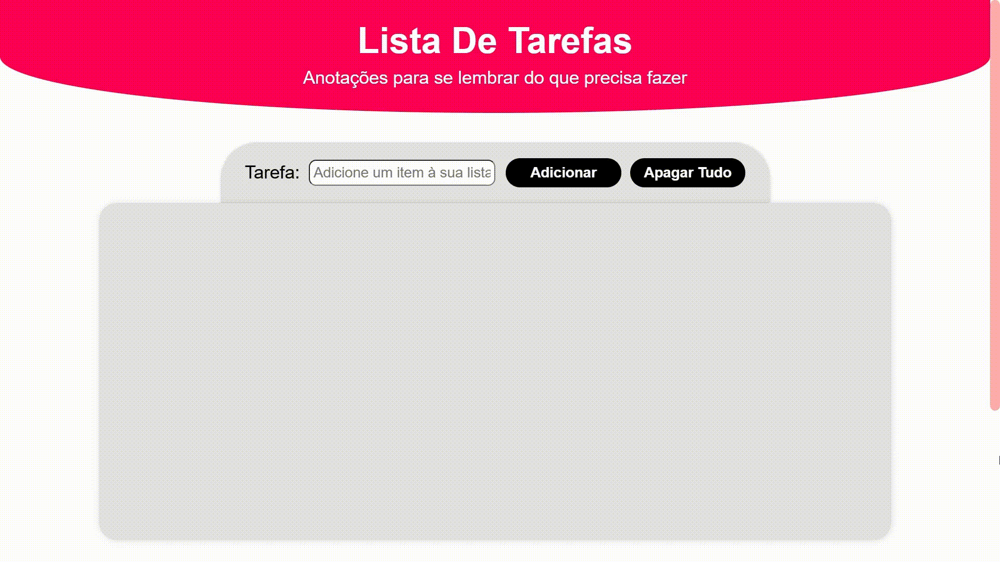

# 🗒️ Lista De Tarefas

 Uma página web para criar a sua própria lista de tarefas e que utiliza o **Local Storage** para salvar as tarefas já criadas e suas alterações até que você apague-as. Vale lembrar que a persistência dos dados é feita por navegador.

## 🪄 Funcionalidades

 - Mais acessibilidade usando a tecla "tab"
 - Efeitos de "hover" e de "active" nos elementos clicáveis
 - Botão de voltar ao topo da página
 - Adicionar um título e uma descrição como um item na lista
 - Editar título e descrição de um item
 - Apagar um item
 - Apagar todos os itens de uma vez só
 - Marcar um item como concluído
 - Salvar todas as alterações feitas no navegador

## ✅ Demonstração

 [Clique aqui para acessar o website](https://enne-amore.github.io/lista-de-tarefas/)

## 🎞️ Pré-visualização

 

## 🚀 Tecnologias Utilizadas

 

    
    
    
 

## 🌈 Documentação De Cores

| Cor         | Hexadecimal |
| ----------- | ----------- |
| Margenta    | `#ff0055`   |
| Cinza Clara | `#e2e2e2`   |
| Rosa Escura | `#ff6498`   |
| Rosa Clara  | `#ffadad`   |
| Vemelha     | `#ff4545`   |
| Roxa        | `#6200ff`   |
| Verde Clara | `#b9fbc0`   |

## 🌟 Referências De Uso

 - [manshagraphics](https://www.flaticon.com/br/autores/manshagraphics)
 - [www.flaticon.com'](https://www.flaticon.com/br/)

## 🔧 Suporte

 Para me contatar como suporte, o meu email é EnneFofe10@gmail.com 

